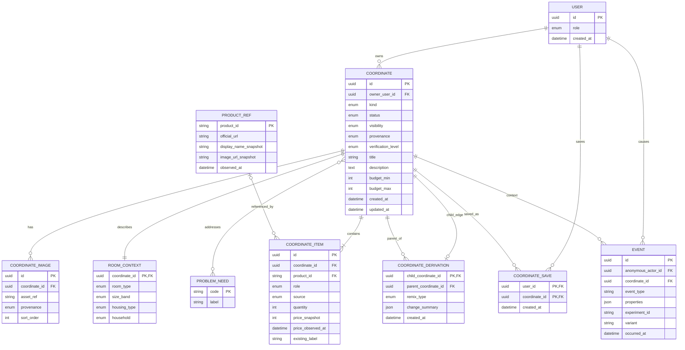

# Logical Data Model

## ER diagram



## Modeling choices

### Coordinate need relation

Logical many-to-many is shown; implementation may use `coordinate_need` join table. Mermaid simplifies the join.

### Price

`price_snapshot` is evidence of what was displayed at a time, not master truth. Total calculation returns:

- `known_total`
- `unknown_item_count`
- `calculated_at`
- `currency`

Unknown price is not zero.

### Product role

Use a controlled but evolvable enum such as `MAIN_FURNITURE`, `SUPPORT_FURNITURE`, `STORAGE`, `LIGHTING`, `TEXTILE`, `DECOR`, `APPLIANCE`, `OTHER`. Do not encode visual style as product role.

### Change summary

Suggested shape:

```json
{
  "kept_item_ids": ["..."],
  "removed_item_ids": ["..."],
  "added_item_ids": ["..."],
  "reason_codes": ["LOWER_BUDGET", "KEEP_EXISTING_FURNITURE"],
  "parent_known_total": 70000,
  "child_known_total": 52000
}
```

This is a future contract example, not an implemented API.

## Similar-to-me query model

Input:

```text
room_type?, size_band?, housing_type?, household?, budget_band?, need_codes[], style_codes[]
```

Output per Coordinate:

```text
coordinate_id, score, matched_dimensions[], relaxed_dimensions[], evidence_quality
```

Ranking is deterministic in MVP. Exact weights are configuration and test evidence, not embedded domain truth.

## Index candidates for future implementation

- Coordinate `(visibility, status, kind, updated_at)`
- Room context `(room_type, size_band, housing_type, household)`
- Coordinate-Need `(need_code, coordinate_id)`
- Coordinate-Item `(product_id, coordinate_id)` for Product→Coordinate
- Derivation `(parent_coordinate_id, created_at)`
- Save `(user_id, created_at)`
- Event `(experiment_id, variant, occurred_at)` and `(coordinate_id, event_type)`

No production database is created in this Goal.

## Goal 2 local physical model

上のERは長期Logical modelである。Goal 2のLocal SQLite implementationはProduction `USER` / Authenticationを作らず、次を追加する。

- `creator_profiles`: internal id、private `owner_session_id`、public display name / bio。
- `coordinates.creator_id`: optional display identity link。
- `coordinates.parent_coordinate_id`: 直接参考にしたCoordinateまたはPrivate PLAN。
- `coordinates.root_coordinate_id`: 派生系列の起点。
- `coordinates.derivation_type`: controlled remix reason。
- `coordinates.moderation_status`: `ACTIVE / HIDDEN` prototype state。
- `coordinate_images`: random local storage referenceとdimensions。original filename / EXIFなし。
- `helpful_reactions`: `(session_id, coordinate_id)` unique current reaction。
- `content_reports`: `(session_id, coordinate_id)` unique report、controlled reason、no auto-delete。

Raw Session IDをPublic APIへ返さない。Hidden / unpublish parentがあってもchild FK recordは削除せず、閲覧者にprivate IDを露出しないtombstone表示を使う。
