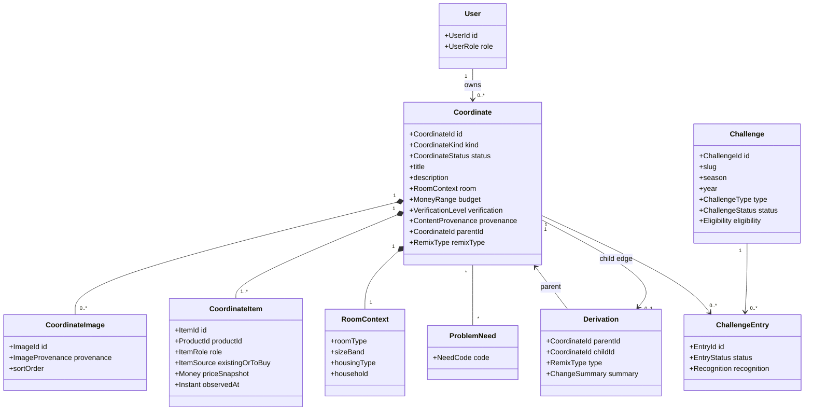
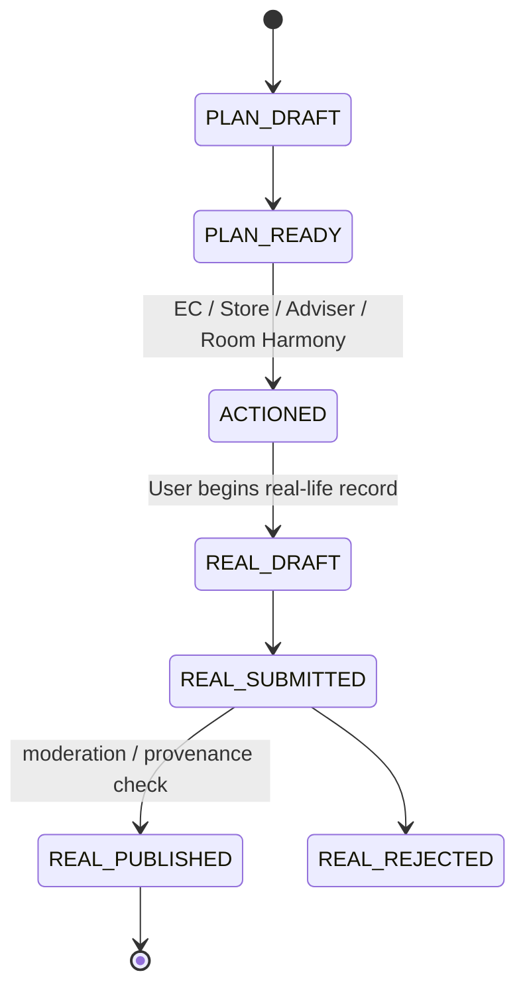

# Domain Model

## Aggregate root: Coordinate

`Post`ではなく`Coordinate`を中心にする。Coordinateは、空間の意図・条件・構成Item・出所・派生関係を保持し、閲覧ContentとPurchase Planの両方を表現する。

## Coordinate kinds and lifecycle

### PLAN

これから実現したい空間。購入・在庫・専門家承認を意味しない。

Candidate statuses:

`DRAFT → READY_FOR_ACTION → ACTIONED → CONVERTED_TO_REAL | ARCHIVED`

### REAL ROOM

実在する生活空間。写真があるだけでProduct使用をverifiedとしない。

Candidate statuses:

`DRAFT → SUBMITTED → MODERATED → PUBLISHED | REJECTED | ARCHIVED`

### Transition

Goal 1ではUser PLANはprivateだけだった。Goal 2以降は、OwnerがPrivate PLANをstructured reason付きPublic PLAN、または画像付き`USER_DECLARED_UNVERIFIED` REALとして再共有できる。購入済み・公式承認・実在性確認を意味しない。

## My Coordinate

`MyCoordinate`は別Entityにしない。UserがownするCoordinateのview / collection名とする。

理由:

- 同じfieldとlifecycleを重複させない。
- PLAN→REAL transitionでID / lineageを追跡しやすい。
- Public / privateはCoordinate visibility / statusとして表せる。

## Remix / Adaptation

RemixはCoordinate間の`Derivation` edgeで表現する。Child側に単一`parent_coordinate_id`を持ち、edgeにchange summaryを持つ。

`RemixType`候補:

- `LOWER_BUDGET`
- `SMALLER_ROOM`
- `COLOR_VARIANT`
- `STORAGE_FOCUS`
- `PRODUCT_REPLACEMENT`
- `KEEP_EXISTING_FURNITURE`
- `OTHER_DECLARED`

MVPはsingle parent / one generation UI。Data modelはmulti-generation chainをたどれる。Multi-parent mergeは過剰設計として除外。

## Existing furniture model

別Product masterへ無理に登録しない。`CoordinateItem`の`source`で区別する。

- `CATALOG_TO_BUY`: NITORI Product referenceあり
- `CATALOG_OWNED`: NITORI Product referenceあり、既に所有
- `EXISTING_EXTERNAL`: Free-form label / dimensions optional、Product IDなし

既存家具の価格はPlan totalへ含めない。Photo / brand等はMVPで不要。

## Product model

Communityの`Product`はreferenceでありmaster copyではない。

Minimum:

- `product_id`
- `official_url`
- optional display snapshot（name / image / price）
- `observed_at`
- `availability_status`（unknownを許可）

Current price / stock / Store positionはapproved Product / Store serviceがtruth source。

## Trust and provenance

`ContentProvenance`:

- `OFFICIAL`
- `STAFF`
- `USER_DECLARED`

`VerificationLevel`:

- `UNVERIFIED`
- `PRODUCT_REFERENCES_VALIDATED`
- `PURCHASE_VERIFIED`（future）
- `OFFICIAL_APPROVED`

`ImageProvenance`:

- `HUMAN_PHOTO`
- `VIRTUAL_RENDER`
- `AI_GENERATED`
- `UNKNOWN`

These are orthogonal. `STAFF` does not automatically mean purchase verified; `REAL` does not automatically validate every Product.

## Challenge / Entry

Goal 3ではChallengeをCoordinate上のSeasonal participation layerとして実装する。Entryは本文・商品・画像を複製せず、既存Public Coordinateを一つ参照する。

`ChallengeStatus`: `UPCOMING / ACTIVE / ENDED / ARCHIVED`

`ChallengeEntryStatus`: `ACTIVE / WITHDRAWN / HIDDEN`

Invariants:

1. 同一Challenge / Coordinate pairは一つだけ。
2. Entry作成はCoordinate ownerだけが行える。
3. Active moderationのPublic REAL / PLANだけが対象。
4. ACTIVE Challengeだけ受付し、structured eligibilityをServerで検証する。
5. Recognitionはcontrolled prototype valueで、User inputではない。
6. Coordinate unpublish時はEntryをwithdrawし、Coordinate / lineage自体は削除しない。

## Deferred entities

| Candidate | Decision | Reason |
|---|---|---|
| Reaction | Deferred | MVP causal chain can be tested with Save / Product / PLAN |
| Comment | Deferred | Moderation / abuse cost |
| Follow | Deferred | Social graph is not core domain |
| Challenge | Implemented in Goal 3 | Structured Seasonal reuse layer; not a contest |
| ChallengeEntry | Implemented in Goal 3 | Existing Public Coordinate reference with ownership / eligibility |
| Notification | Deferred | No creator loop implementation yet |
| Purchase | External reference only | POS / Order owns truth |

## Invariants

1. Coordinate kind is exactly PLAN or REAL.
2. Public REAL requires provenance and moderation status.
3. PLAN is never shown as purchased, stocked, or professional-approved without evidence.
4. Every catalog item has a Product ID and source URL.
5. `total_price` includes only known `TO_BUY` snapshots and carries `calculated_at` / completeness.
6. Derivation cannot self-reference and must not form a cycle.
7. Child keeps its own context and items; it is not a mutable alias of parent.
8. Existing furniture can exist without a Product ID.
