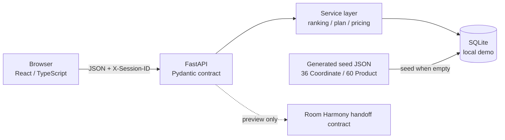

# Functional MVP Implementation Architecture

## Runtime shape

FrontendとBackendはHTTP boundaryで分離する。React componentからSQLiteへ直接Accessせず、FastAPI routeからUI stateを直接操作しない。

## Frontend routes

| Route | Screen / purpose |
|---|---|
| `/` | Home / target / quick need / seasonal collection |
| `/explore` | Similar / editorial baseline / new-life discovery |
| `/create` | Progressive REAL / PLAN contribution form |
| `/creators/:id` | Display Identity、contribution history、useful impact |
| `/coordinates/:id` | Coordinate detail / role / total / Save / PLAN start |
| `/products/:id` | Product detail → use Coordinate |
| `/saved` | Saved and private PLAN separation |
| `/plans/:id` | PLAN summary and action readiness |
| `/plans/:id/edit` | keep / replace / add / existing furniture / total |
| `/plans/:id/handoff` | Room Harmony payload preview only |
| `/about` | Demo truth boundary / H1〜H3 readiness |

## Backend modules

- `backend/app/models/entities.py`: Product、Coordinate、CreatorProfile、Image、Helpful、Report、Save、AnalyticsEvent
- `backend/app/ranking/similarity.py`: fixed-weight deterministic Similar-to-me
- `backend/app/services/plans.py`: private clone、item mutation、existing furniture、ready transition
- `backend/app/services/pricing.py`: known total and explicit unknown count
- `backend/app/services/seed.py`: empty-database seed only
- `backend/app/services/community.py`: Creator、public contribution、Helpful、lineage、impact、ownership
- `backend/app/services/images.py`: actual decode、EXIF removal、WebP normalization、random local storage
- `backend/app/core/schema.py`: Goal 1 SQLiteからのnon-destructive local upgrade
- `backend/app/integrations/room_harmony/handoff.py`: versioned payload creation; no network call
- `backend/app/api/`: catalog、saved、plans、analytics HTTP routes

## Contract ownership

FastAPIがruntime OpenAPIを`/openapi.json`へ公開する。Frontendの`src/api/types.ts`はMVPで必要なresponse shapeをTypeScriptとして固定し、`src/api/client.ts`以外からAPIへ直接Accessしない。Backend integration testはrequired pathがOpenAPIに残ることを確認する。

Discovery responseとAnalytics eventの`comparison_condition`は、User自身が選択した`similar / popular / newlife`表示を記録する。Randomized group assignment、sticky allocation、causal A/B resultを意味しない。SQLiteの既存互換のため内部column名だけは`experiment_group`を維持するが、公開API・Python domain・Frontendでは使用しない。

## Anonymous demo identity

Frontendはrandom local Session IDをBrowser localStorageへ保存し、`X-Session-ID`で送る。これはAuthenticationではなく、同じBrowser内のSave / Private PLANを再現するためだけのtest identityである。`owner_session_id`はBackend ownership checkにのみ使い、Coordinate responseへ返さない。名前、email、会員ID、住所、room photoを保存しない。

## Goal 2 Creator loop — active prototype

`CreatorProfile`はanonymous Sessionに内部だけで紐づくDisplay Identityである。Public APIはraw Session IDを返さない。`Coordinate`は`creator_id`、`parent_coordinate_id`、`root_coordinate_id`、structured `derivation_type`を持ち、Public REAL / PLAN → Private PLAN → Public derivativeを表現する。Helpful、Save、PLAN開始、Public adaptationはfake seed countではなくSQLiteから集計する。

## Security / trust boundary

- Handoffの`return_url`はlocal pathだけ許可する。
- Analytics event名とproperty keyをallowlistで制限し、free-textを入れない。
- CORSはlocalhost development originだけ。
- Official URLはserver seedで管理し、User inputをredirect URLとして使わない。
- Demo dataをproduction truthとして扱わない。
- UploadはJPEG / PNG / WebPだけをactual decodeし、最大8MB、最大25MP、最大5件。server-side remote URL取得、SVG、path traversalを拒否する。
- Public REALは1枚以上の画像を要求し、`USER_DECLARED_UNVERIFIED`として表示する。
- Report reasonはcontrolled enumで保存し、報告だけで自動削除しない。
- 自分のPublic Coordinateだけedit / unpublish可能。unpublishはlineageを残し、Local image fileは公開Storageから削除する。

## Verification ownership

- Seed: `scripts/validate_data/validate_seed.py`
- Backend: `backend/tests/`（pytest）
- Frontend unit: `frontend/src/**/*.test.tsx`（Vitest）
- Browser / responsive: `frontend/e2e/`（Playwright、390 / 768 / 1280）
- Windows lifecycle: `start-demo.cmd` / `stop-demo.cmd`
- Second physical PC: `docs/operations/second-pc-checklist.md`（manual gate）
