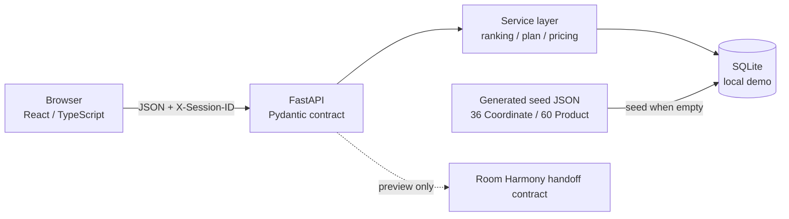

# Functional MVP Implementation Architecture

## Runtime shape

FrontendとBackendはHTTP boundaryで分離する。React componentからSQLiteへ直接Accessせず、FastAPI routeからUI stateを直接操作しない。

## Frontend routes

| Route | Screen / purpose |
|---|---|
| `/` | Home / target / quick need / seasonal collection |
| `/explore` | Similar / editorial baseline / new-life discovery |
| `/coordinates/:id` | Coordinate detail / role / total / Save / PLAN start |
| `/products/:id` | Product detail → use Coordinate |
| `/saved` | Saved and private PLAN separation |
| `/plans/:id` | PLAN summary and action readiness |
| `/plans/:id/edit` | keep / replace / add / existing furniture / total |
| `/handoff/:id` | Room Harmony payload preview only |
| `/about` | Demo truth boundary / H1〜H3 readiness |

## Backend modules

- `models`: Product、Coordinate、Need、Item、Save、AnalyticsEvent
- `services/ranking.py`: fixed-weight deterministic Similar-to-me
- `services/plans.py`: private clone、item mutation、existing furniture、ready transition
- `services/pricing.py`: known total and explicit unknown count
- `services/seed.py`: empty-database seed only
- `integrations/room_harmony.py`: versioned payload creation; no network call
- `api`: catalog、saved、plans、analytics

## Contract ownership

FastAPIがruntime OpenAPIを`/openapi.json`へ公開する。Frontendの`src/api/types.ts`はMVPで必要なresponse shapeをTypeScriptとして固定し、`src/api/client.ts`以外からAPIへ直接Accessしない。Backend integration testはrequired pathがOpenAPIに残ることを確認する。

## Anonymous demo identity

Frontendはrandom local Session IDをBrowser localStorageへ保存し、`X-Session-ID`で送る。これはAuthenticationではなく、同じBrowser内のSave / Private PLANを再現するためだけのtest identityである。名前、email、会員ID、住所、room photoを保存しない。

## Future creator slots — inactive

`Coordinate`は`creator_display`、`creator_type`、`official_pick`、`seasonal_recognition`、`ready_for_creator_impact`を持つ。Responseには将来の`helpful / saved / adaptation`集計slotがある。Analytics contractにはattributed impression / save / plan-start名を予約するが、MVP UIにはreaction、ranking、reward、public uploadを置かず、Eventも自動発火しない。

## Security / trust boundary

- Handoffの`return_url`はlocal pathだけ許可する。
- Analytics event名とproperty keyをallowlistで制限し、free-textを入れない。
- CORSはlocalhost development originだけ。
- Official URLはserver seedで管理し、User inputをredirect URLとして使わない。
- Demo dataをproduction truthとして扱わない。
