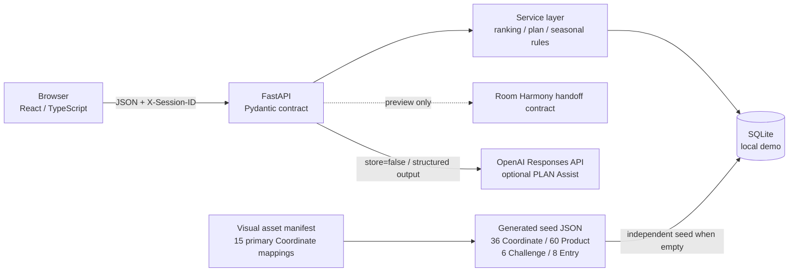

# Functional MVP Implementation Architecture

## Runtime shape

FrontendとBackendはHTTP boundaryで分離する。React componentからSQLiteへ直接Accessせず、FastAPI routeからUI stateを直接操作しない。

## Frontend routes

| Route | Screen / purpose |
|---|---|
| `/` | Home / target / quick need / seasonal collection |
| `/seasonal` | Active / Constraint / Upcoming / previous-year reuse loop |
| `/challenges/:slug` | eligibility、real counts、Entry、Prototype Pick、gallery |
| `/explore` | Similar / editorial baseline / new-life discovery |
| `/create` | Progressive REAL / PLAN contribution form |
| `/creators/:id` | Display Identity、contribution history、useful impact |
| `/coordinates/:id` | Coordinate detail / role / total / Save / PLAN start |
| `/products/:id` | Product detail → use Coordinate |
| `/saved` | Saved and private PLAN separation |
| `/plans/:id` | PLAN summary and action readiness |
| `/plans/:id/edit` | keep / replace / add / existing furniture / total / deterministic fit / AI PLAN Assist |
| `/plans/:id/handoff` | Room Harmony payload preview only |
| `/about` | Demo truth boundary / H1〜H3 readiness |

## Backend modules

- `backend/app/models/entities.py`: Product、Coordinate、CreatorProfile、Image、Helpful、Report、Save、AnalyticsEvent
- `backend/app/ranking/similarity.py`: fixed-weight deterministic Similar-to-me
- `backend/app/services/plans.py`: private clone、item mutation、existing furniture、ready transition
- `backend/app/services/pricing.py`: known total and explicit unknown count
- `backend/app/services/seed.py`: empty-database seed only
- `backend/app/services/community.py`: Creator、public contribution、Helpful、lineage、impact、ownership
- `backend/app/services/seasonal_rules.py`: structured Challenge eligibility evaluation
- `backend/app/services/seasonal.py`: Challenge list/detail、real DB counts、Entry、Archive / Creator aggregate
- `backend/app/services/images.py`: actual decode、EXIF removal、WebP normalization、random local storage
- `backend/app/core/schema.py`: Goal 1 SQLiteからのnon-destructive local upgrade
- `backend/app/integrations/room_harmony/handoff.py`: versioned payload creation; no network call
- `backend/app/api/`: catalog、saved、plans、analytics HTTP routes
- `backend/app/api/seasonal.py`: Seasonal landing、Challenge list/detail、Entry HTTP routes
- `backend/app/ai/`: versioned policy、preference profile、deterministic scoring、server candidate validation、OpenAI Responses adapter、stale-safe preview/apply

## Contract ownership

FastAPIがruntime OpenAPIを`/openapi.json`へ公開する。Frontendの`src/api/types.ts`はMVPで必要なresponse shapeをTypeScriptとして固定し、`src/api/client.ts`以外からAPIへ直接Accessしない。Backend integration testはrequired pathがOpenAPIに残ることを確認する。

Discovery responseとAnalytics eventの`comparison_condition`は、User自身が選択した`similar / popular / newlife`表示を記録する。Randomized group assignment、sticky allocation、causal A/B resultを意味しない。SQLiteの既存互換のため内部column名だけは`experiment_group`を維持するが、公開API・Python domain・Frontendでは使用しない。

## Anonymous demo identity

Frontendはrandom local Session IDをBrowser localStorageへ保存し、`X-Session-ID`で送る。これはAuthenticationではなく、同じBrowser内のSave / Private PLANを再現するためだけのtest identityである。`owner_session_id`はBackend ownership checkにのみ使い、Coordinate responseへ返さない。名前、email、会員ID、住所、room photoを保存しない。

## Goal 2 Creator loop — active prototype

`CreatorProfile`はanonymous Sessionに内部だけで紐づくDisplay Identityである。Public APIはraw Session IDを返さない。`Coordinate`は`creator_id`、`parent_coordinate_id`、`root_coordinate_id`、structured `derivation_type`を持ち、Public REAL / PLAN → Private PLAN → Public derivativeを表現する。Helpful、Save、PLAN開始、Public adaptationはfake seed countではなくSQLiteから集計する。

## Goal 3 Seasonal loop — active prototype

`Challenge`はCoordinateを置き換えず、既存Public REAL / PLANへ`ChallengeEntry`を結ぶ。Serverはstatus、ownership、visibility、moderation、duplicate、room / household / housing / budget / kind / image / Product countを検証する。Previous-year ArchiveからGoal 2のPrivate PLAN / lineageを通ってCurrent Challengeへ再参加できる。

Recognitionはbundled Demo seedだけのcontrolled `Prototype Pick`で、User APIから設定できない。参加数、REAL / PLAN内訳、Creator participation / reuseはSQLite current stateから集計し、fake ranking countは持たない。詳細は[`seasonal-growth.md`](seasonal-growth.md)を参照。

`direct_seasonal_reuse_count`は、Creator自身のChallenge参加Coordinateを直接の親として作られたchild PLAN / Coordinateの件数である。公開・非公開、同一・別Sessionを含むが、孫以降のdescendantは含まない。Creatorの再利用状況を説明するPrototype集計であり、購買・成長KPIではない。

## Goal 4 final-demo hardening

- `data/seed/visual_asset_manifest.json`がMain Demo 15 Coordinateと個別local SVG、future realistic asset filename、rights、visual directionを対応付ける。画像参照はDomain logicやrankingから独立する。
- `SafeImage`がmissing / failed room・product assetをrepository-local fallbackへ切り替え、remote fetchに依存しない。
- API clientはknown HTTP / eligibility / upload errorをactionableな日本語へ変換し、stack traceやinternal reason codeをMain UIへ出さない。
- passive page exposure eventは`trackOnce`で同一Browser runtime内の重複送信を抑える。Save、Helpful、Publish等の明示Action eventは通常通り送る。
- visual QAはport 8100 / 5174とprocess-scoped SQLite / upload directoryを所有し、Main Demo DBを変更しない。
- `reset-demo.cmd`は明示確認後、Repository内`.demo`のknown DB / uploadsだけを初期化する。Source、logs、visual QA capture、unmanaged processは変更しない。

## Phase 2A Personalized AI PLAN Assist

AIはPLAN Edit内の補助層で、別Chat pageではない。BackendがNTR候補、action、対象item、price、fit、fingerprintを所有する。ProviderはStructured Outputsで候補を返すだけで、`store=False`、no tools、no historyで呼ぶ。Human apply後は既存PLAN mutation serviceを通し、同じdeterministic scorerで再評価する。Key、privacy、weight、error / stale contractは[`personalized-ai-plan-assist.md`](personalized-ai-plan-assist.md)に固定する。

## Security / trust boundary

- Handoffの`return_url`はlocal pathだけ許可する。
- Analytics event名とproperty keyをallowlistで制限し、free-textを入れない。
- CORSはlocalhost development originだけ。
- Official URLはserver seedで管理し、User inputをredirect URLとして使わない。
- Demo dataをproduction truthとして扱わない。
- UploadはJPEG / PNG / WebPだけをactual decodeし、最大8MB、最大25MP、最大5件。server-side remote URL取得、SVG、path traversalを拒否する。
- Public REALは1枚以上の画像を要求し、`USER_DECLARED_UNVERIFIED`として表示する。
- Report reasonはcontrolled enumで保存し、報告だけで自動削除しない。
- 自分のPublic Coordinateだけedit / unpublish可能。unpublishはlineageを残し、Local image fileは公開Storageから削除する。
- Challenge EntryはOwnerのPublic / Active Coordinateだけ許可し、unpublish時にwithdrawする。
- Challenge、Recognition、画像、価格はDemoであり、NITORI公式Campaign / 選定 / live dataではない。

## Verification ownership

- Seed: `scripts/validate_data/validate_seed.py`
- Backend: `backend/tests/`（pytest）
- Frontend unit: `frontend/src/**/*.test.tsx`（Vitest）
- Browser / responsive: `frontend/e2e/`（Playwright、390 / 768 / 1280）
- Visual render: `frontend/scripts/capture-visual-qa.mjs`（temporary DB、57 captures、horizontal overflow check）
- Windows lifecycle: `start-demo.cmd` / `stop-demo.cmd` / `reset-demo.cmd`
- Second physical PC: `docs/operations/second-pc-checklist.md`（manual gate）
