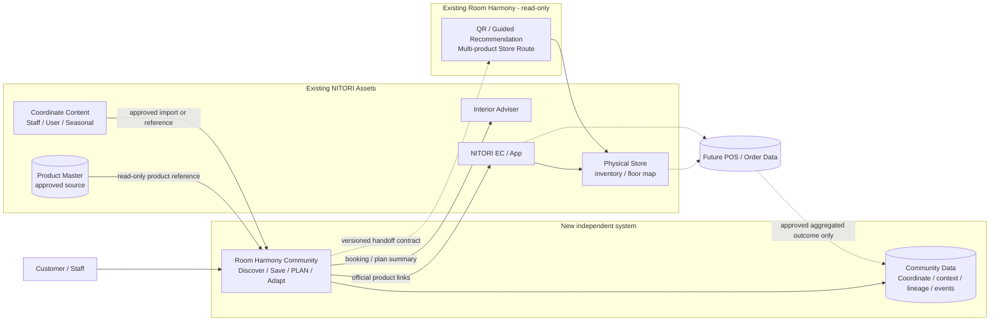

# System Architecture Overview

## Architecture intent

CommunityとRoom Harmonyは独立Repository / serviceとして分離する。UXでは一つの目的Flowに見せるが、Data ownershipとfailure boundaryを混ぜない。

## System context



Dashed arrows are future / approval-dependent. This Goal implements none of them.

## Logical components

| Component | Responsibility | Owns | Must not own |
|---|---|---|---|
| Community Web | Discover、filter、detail、save、private PLAN、adapt、handoff | Community UI state | Store route、inventory truth、payment |
| Community API (future) | Coordinate query、PLAN lifecycle、save、event | Coordinate / lineage / save / event | Product master truth、POS raw data |
| Retrieval service (future) | Deterministic similar-to-me ranking | Ranking config / reason | Production ML in MVP |
| Product reference adapter | Approved Product ID / URL / snapshot resolution | Reference metadata / timestamp | Unapproved scraping |
| NITORI EC / App | Product、current price / stock、Cart、Store info | Commerce truth | Community social state |
| Room Harmony | QR、guided recommendation、route、visit session | Store visit / recommendation / route | Community feed / PLAN / creator graph |
| Future analytics join | Community / Room Harmony / POS attribution | Approved aggregate | PII or free text by default |

## Data ownership

```text
Community truth: Coordinate context, PLAN / REAL, derivation, save, community events
Product truth:   Approved NITORI Product Master / EC
Store truth:     NITORI inventory / floor / fixture systems
Visit truth:     Room Harmony session and route events
Purchase truth:  POS / order system after approved join
```

Community may cache a Product display snapshot with `observed_at` but never label it current stock or current price without an approved freshness contract.

## Deployment boundary

Phase 1 prototype remains independent and can use static Seed data. No shared database, no direct import from Existing Room Harmony, no modification of its code, no production authentication, and no production deployment in the current Goal.

## Security and privacy principles

- No PII / room free text / photo URL in query parameters.
- Handoff uses short-lived opaque `handoff_id` when a server exists; prototype may show a non-live payload preview.
- Room context uses bands / enums in analytics, not exact address or floorplan by default.
- REAL ROOM photo requires explicit consent, provenance, moderation, deletion route.
- Product / price / stock responses state source and freshness.
- POS join uses approved pseudonymous attribution and aggregate output only.

## Reliability principles

- EC / Room Harmony unavailable: keep PLAN and show retry / official fallback link.
- Product discontinued: preserve historical Coordinate role, mark unavailable, offer no automatic replacement in MVP.
- Sparse similar results: relax one constraint at a time and explain which.
- Unknown price: exclude from total or show a partial total; never silently treat it as zero.
