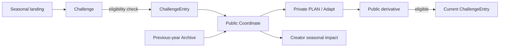

# Goal 3 Seasonal Growth Architecture

## Runtime relationship

`Coordinate`が引き続きAggregate rootで、`ChallengeEntry`は参加関係だけを持つ。Goal 2のCreate、PLAN、Parent / Root lineage、Helpful、Save、moderationを置き換えない。

## Backend ownership

| Module | Responsibility |
|---|---|
| `models/entities.py` | `Challenge`、unique Challenge / Coordinate pairを持つ`ChallengeEntry` |
| `schemas/seasonal.py` | Status、Season、Type、Eligibility、Constraint、Recognition contract |
| `services/seasonal_rules.py` | Coordinateに対するdeterministic eligibility evaluation |
| `services/seasonal.py` | listing、real DB counts、ownership、entry、archive / creator aggregate |
| `api/seasonal.py` | `/api/seasonal`、Challenge list/detail、Entry POST |
| `services/community.py` | unpublish時のEntry withdrawal |
| `services/seed.py` | Goal 2 DBにも独立してGoal 3 seedを追加 |

## API surface

| Method / path | Meaning |
|---|---|
| `GET /api/seasonal` | Active、constraint、upcoming、previous-year summary |
| `GET /api/challenges` | status / season / typeでChallengeを列挙 |
| `GET /api/challenges/{slug}` | conditions、real counts、Entry gallery、owned candidates |
| `POST /api/challenges/{slug}/entries` | existing Public Coordinateを参加させる |
| `GET /api/coordinates/{id}` | Challenge contextと参加可能Challengeを返す |
| `GET /api/creators/{id}` | seasonal participation / recognition / reuse aggregate |

Entry POSTは`coordinate_id`以外を受け取らず、recognition自己設定をPydantic `extra=forbid`で拒否する。

## Data truth

- Challenge参加数、REAL / PLAN数、Creator participationはSQLite current stateから集計する。
- Hidden Coordinate、Hidden / Withdrawn EntryはPublic responseとcountから除外する。
- SeedのRecognitionだけcontrolled valueとして保存する。fake popularity / view / rank countはない。
- `ChallengeEntry.creator_id`はUser contributionのownership trace用。Bundled anonymous demo seedはnullableで、実在社員やUserを装わない。
- 全Challenge、Entry、画像は`DEMO` / repository-local assetで、NITORI公式Campaignではない。

## Frontend responsibility

- `/seasonal`: 年間Loop、Active / Constraint / Upcoming、Previous-year Archive。
- `/challenges/:slug`: why、structured constraints、real counts、owned candidate、Prototype Pick、gallery。
- `/create?challenge=:slug`: 既存Create flowを再利用し、条件をprefillしてPublish後にEntry。
- Coordinate Detail: challenge context、Ownerのexisting-coordinate entry。
- Creator Profile: participation、recognition、direct reuse impact。

Homeの主導線はCoordinate discoveryのままにし、Seasonalは補助CTAとして置く。Top-levelの独立SNSやContestにはしない。

## Failure handling

- Publish成功後にEntryだけ失敗した場合、作成済みCoordinateへのLinkと失敗理由を表示し、二重投稿を防ぐ。
- Duplicate、ownership mismatch、ineligible fieldはcontrolled error code / messageで返す。
- DB unique constraintはapplication check後のrace conditionも拒否する。
- status自動遷移、Production moderation queue、Notificationは未実装。
