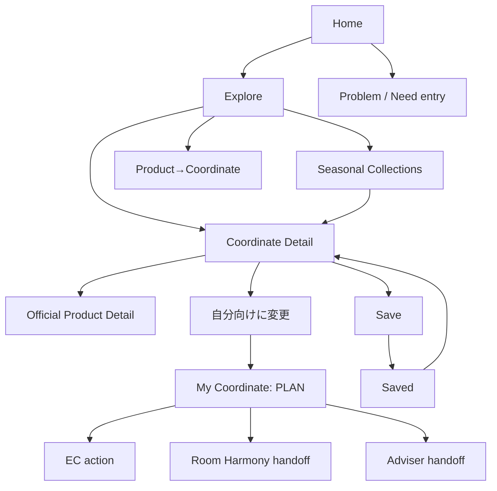

# UX Information Architecture

## Navigation decision

MVP top-level:

- Home
- Explore
- My Coordinate
- Saved
- Profile / Settings（minimal）

`Create` is contextual inside My Coordinate / Coordinate Detail. `Challenge` stays under Explore.

理由:

- 全Userが投稿 / 作成する前提を置かない。
- Empty create screenより、既存CoordinateからPLAN化する方が低負担。
- Seasonal participationはRecurring behaviorが未検証で、Top-levelにするには早い。

## Sitemap

## Screen responsibilities

| Screen | User goal | Primary action | Secondary action | Business role |
|---|---|---|---|---|
| Home | どこから始めるか知る | Room / Needを1つ選ぶ | Seasonal / Product entry | Qualified discovery start |
| Explore | 自分に近い事例を比較 | Coordinateを開く | Filter / sort / save | Relevant asset exposure |
| Coordinate Detail | 条件・商品・信頼性を理解 | Productを見る / My PLANにする | Save / sourceを見る | Multi-product awareness |
| Product→Coordinate | この商品を使う実例を見る | Coordinateを開く | Official productへ戻る | Cross-category discovery |
| Saved | 検討を再開 | Detail / PLANへ | Remove | Revisit / intent retention |
| My Coordinate | 自分のPLANを具体化 | Itemをkeep / replace / add | Room / budget / existing edit | Actionable multi-product plan |
| Handoff review | 店舗 / ECへ何を渡すか確認 | Continue | Remove item / cancel | Channel action |
| Profile / Settings | Consent / saved stateを管理 | Privacy / delete | Preferences | Trust / retention |
| Seasonal Collection | 時期の課題に合う事例を見る | Coordinateを開く | Similar filters | Recurring reactivation |

## Home entry design

自由作文を最初に要求しない。次の一つを選べば進める。

1. 部屋から: 6畳 / One-room / Living等
2. 困りごとから: Storage / rental / low budget / WFH等
3. 商品から: Official Product ID / link

Additional conditions are progressive disclosure. This follows the earlier insight that users often cannot spontaneously enumerate useful room information.

## Coordinate card hierarchy

1. Image + REAL / PLAN badge
2. Match reason（例: `6畳・賃貸・収納不足が近い`）
3. Title / Creator provenance
4. Estimated total / unknown count
5. Product count + category count
6. Save

Popularity count is secondary and optional, preventing visual competition from dominating usefulness.

## Coordinate detail hierarchy

1. Trust: REAL / PLAN、Official / Staff / User declared、image provenance
2. Room / Need / Budget context
3. Explanation / practical tips
4. Product roles and existing furniture
5. Estimated total and freshness caveat
6. Primary CTA: `自分向けPLANにする` or `商品を見る`
7. Store / EC / adviser / Room Harmony actions
8. Parent / child lineage if applicable

## Accessibility and visual rules

- Badge meaning is text + color, not color only.
- Minimum 44px touch targets and visible focus.
- Product / route actions remain readable at 390px without horizontal overflow.
- Image ratio does not push the first decision below multiple screens.
- Unknown / unavailable data is explicit, not blank.
- Long Japanese product names wrap without hiding price / role.
- Map / route is not rendered in Community; avoid duplicating Room Harmony visual complexity.

## Unknowns to test

- `My Coordinate` terminology is understandable to first-time users.
- SaveとPLANのdistinction is clear.
- Three home entry modes reduce cognitive load.
- Match reason builds trust instead of appearing as opaque AI.
- Challenge under Explore is discoverable enough during seasonal demand.
