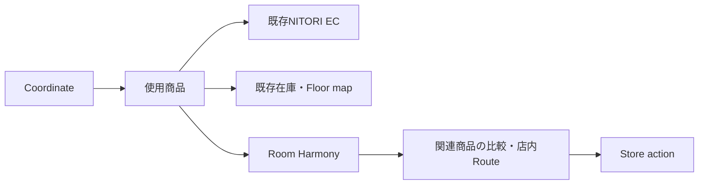

# Gap Analysis: Current NITORI × Proposed Community

## Core finding

**INFERENCE**: Gapは「Coordinate contentの量」ではなく、現在分散している閲覧・商品・相談・店舗資産の間に、利用者の文脈と状態を保持する `Coordinate` がないことにある。

```text
現在:  Feature / List / Detail / Product / Simulation / Adviser / Store が個別に強い
不足:  発見した事例を自分の条件へ変換し、PLANとして持ち、行動し、REALとして戻す共通状態
```

## Gap matrix

| Dimension | Current public observation | Proposed role | Claim label | Causal contribution | MVP |
|---|---|---|---|---|---|
| Social / emotional | CoordinateへのNative reaction / save / comment / followは監査面で未確認。Instagram原投稿への接続あり | 「参考になった」「真似したい」「保存」「派生された」等、役立ちをCreatorへ返す | OBSERVATION + HYPOTHESIS | Creator継続動機→事例蓄積→探索価値 | Saveのみ。公開Reactionは除外 |
| Creation | Instagram hashtag由来User Coordinate、Staff Coordinateあり | Native REAL / PLANとprovenanceを構造化 | OBSERVATION + INFERENCE | 条件付き事例→自分に近い発見 | Seed dataのみ。Public upload除外 |
| Remix | Genealogy / change summaryは未確認 | 元Coordinateと「何をなぜ変えたか」を保存 | OBSERVATION + HYPOTHESIS | 既存事例を低負担で自分向けPlanへ | Limited “自分向けに変更” |
| Personalization | Category / Tag /人気・recommendationはある | Room size、housing、household、budget、existing furniture、needの複合一致 | OBSERVATION + HYPOTHESIS | Useful-for-me→商品探索 | Deterministic filter / score |
| Planning | Simulation・専門Staff 3D /見積あり | Persistent My Coordinate、total、replacement、checklist、handoff | VERIFIED FACT + INFERENCE | Inspiration→具体的な複数商品検討 | Light PLAN + total + status |
| Commerce | Coordinate→Product、Product→Staff Coordinate、Cart、Store stock / mapあり | Structured product roles、plan total、Store / EC CTA | VERIFIED FACT + INFERENCE | 空間単位の商品認知→行動 | Product links + events |
| Offline | App Store Mode / Floor map、Room Harmony routeあり | Saved PLANをStore contextへhandoff | VERIFIED FACT + HYPOTHESIS | 検討→実物確認→複数売場訪問 | Contract / stub only |
| Existing furniture | Adviserで条件付き相談可能 | `EXISTING`と`TO_BUY`を同一Coordinateで表現 | VERIFIED FACT + INFERENCE | 全買替えを避け、買い足しを現実化 | 1件以上のexisting item memo |
| Trust | Staff / Userの出所は見える | REAL / PLAN、STAFF / OFFICIAL / USER_DECLARED、image provenance | OBSERVATION + INFERENCE | 誤認防止→意思決定の信頼 | Badge / field only |
| Growth | Seasonal editorial / campaignはある | 前年REAL→今年PLAN→購入→今年REAL→翌年Seed | VERIFIED FACT + HYPOTHESIS | 一回性CampaignをRecurring loopへ | Seasonal collection only |

## Social / emotional gap

Public CoordinateにSNSを丸ごと追加する必要はない。最初に検証すべきなのは「会話量」ではなく、「誰かの暮らしに役立ったこと」がCreatorへ返ると、次の有用な事例が増えるかである。

優先順位案:

1. Save（閲覧者の将来意図）
2. 「参考になった / 真似したい」（Likeより意味が明確）
3. Remix count / Product view contribution（Creator impact）
4. Official Pick / Seasonal recognition
5. Comment / Follow（Moderation costが大きいため後段）

**HYPOTHESIS**: Like数よりSave、Product View、Add to My Coordinate、Store Viewの方が併売率仮説に近い。これは事実ではなくAnalyticsで検証する。

## Creation and Remix gap

Remixは画像Copyではない。次を明示する「Plan transformation」である。

- 元のCoordinate
- 変更理由（6畳、低予算、収納、色、既存家具）
- 残した商品 / 置換した商品 / 既存家具
- Total priceの差
- PLANかREALか

これにより `Coordinate A → B → C` の派生を説明できる。MVPでは公開投稿や競争を作らず、User private PLANとして1世代の派生だけを検証する。

## Personalization gap: “Similar to me”

### Required input

- Room type / size band
- Housing type
- Household
- Budget band
- Style（optional）
- Problem / Need（storage、small room、rental、work from home等）
- Existing furniture（optional）

### Deterministic ranking signals

| Signal | Suggested weight direction | Reason |
|---|---:|---|
| Need match | Highest | 購入理由に近い |
| Room size / type fit | High | 物理制約 |
| Budget fit | High | 実現可能性 |
| Housing / household fit | Medium | 生活条件 |
| Existing furniture compatibility | Medium | 買い足し現実性 |
| Style match | Medium | 嗜好 |
| Save / helpful evidence | Low and guarded | Popularity biasを避ける |

Fallback: 入力なしはOfficial / Staff Seedと多様なNeedを表示し、1つだけ状況質問を提案する。Data不足時は「一致」と断定せず「近い条件」と表示する。MLはMVPに不要。

## Planning gap

MVPのMy Coordinateは3D Editorではない。以下で十分である。

- 基にしたCoordinate
- Room / Need / Budget
- 残す既存家具
- 検討商品と役割
- Estimated total
- PLAN status
- ECで見る / 店舗で見る / Room Harmonyへ渡す

Compare plans、purchase checklist、multiple substitutions、shared editingはPost-MVP。

## Commerce / offline gap



Communityは価格・在庫・Mapの真実源にならない。Product ID / URL / Store IDを保持し、既存EC / App / Room Harmonyへ渡す。公式Contractがない段階ではDeep-link schemaの定義までで停止する。

## Growth gap

ContestはGrowth loopではなく入力施策である。次の循環が成立して初めてPlatformになる。

`Useful Coordinate → Save / PLAN → Store / EC → REAL → Structured share → Similar userに再発見`

Seasonal ChallengeやOfficial Pickはこの循環の「Seedと再活性化」に使う。投稿数だけを成功指標にしない。

## What not to build

- Instagram型の無限Feed + Like / Comment / Follow一式
- 既存ECのCart / Inventory / Product review
- 既存Simulationと競合するFull 3D editor
- Room HarmonyのQR / Recommendation / Store route
- 根拠のないAI画像・自動Style判定
- Product / Store / POSの非公式Scraping連携

## Decision-ready gap statement

> **INFERENCE**: NITORIに足りないと仮定するのは「写真」ではなく、Coordinateを利用者のRoom条件・Need・Budget・Existing Furnitureに合わせてPLAN化し、既存EC / Store / Room Harmonyへ渡し、購入後のREALを次の人に再利用可能な形で戻す一貫した状態管理である。
