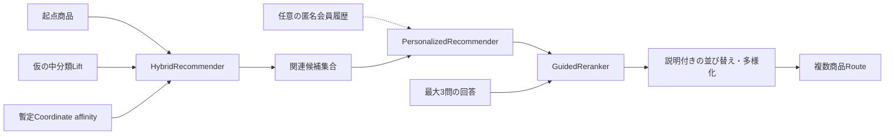

# Existing Room Harmony Audit

監査日: 2026-08-18（JST）
Read-only baseline: `Raiden-Blade/room-harmoney@d41f411a783f555fd4828cb001695c30126e3bb5`

## Executive conclusion

**VERIFIED FACT**: Existing Room Harmonyは、店頭QR / 商品番号から来店Sessionを開始し、商品Detail、関連商品と暫定Coordinate、最大3問のGuided Chat、候補の後段Reranking、複数商品Store Route、匿名Event / KPIへつなぐReact + FastAPIの統合Prototypeである。[RH-002][RH-003][RH-012]

**VERIFIED FACT**: 外部OpenAI APIやNITORI既存Botには実接続していない。現在のChatはPythonのQuestionPolicy、GuidedReranker、TemplateResponseComposerで動き、`sk-...` API keyを必要としない。[RH-002][RH-005][RH-010]

**VERIFIED FACT**: 9,180件の商品MasterはNITORI EC商品Page情報を手動取得済みCSVから変換したが、併売Lift、Coordinate、Store map、POS値はProduction truthではない。[RH-002][RH-007]

**INFERENCE**: Room HarmonyはCommunityの「店内実行・推薦」側として再利用すべきで、CommunityのFeed、Save、PLAN / REAL、Remix、Creator feedbackを抱え込ませるべきではない。

## Audited implementation map

| Capability | Current implementation | Status | Material limitation |
|---|---|---|---|
| Product QR | `GET /api/qr/{qr_id}`、Camera / URL fallback、商品番号から動的QR解決 | Implemented | `qr_codes.json`は入口QRのみ明示。商品QRは商品番号から動的に解決。実店舗発行体系ではない。 |
| Session / visit lock | `POST /api/session`、匿名UUID、QR起点座標、treatment / control、無効Sessionで中核機能lock | Implemented | 店内判定はQR起点。Wi-Fi / geofenceなし。 |
| Product detail | 9,180商品Masterから名称・価格・画像・分類・色・売場等を返す | Implemented | 在庫なし。価格更新Feedなし。色は1,438 / 9,180件のみ非空。 |
| Related recommendation | `HybridRecommender`: 中分類Lift + Coordinate affinity | Implemented | Liftは12カテゴリPairの仮設定。商品単位の実POSではない。 |
| Optional personalization | `PersonalizedRecommender`: 匿名会員履歴がある場合だけbase候補を再rank | Implemented as optional slot | Sample / optional data。Production member integrationなし。 |
| Coordinate affinity | 起点商品を含むCoordinateの構成商品を加点 | Implemented | Coordinateは決定的に生成した暫定6Set、画像はdummy。Stylist入稿ではない。 |
| Guided Chat | 最大3問、選択肢 / keyboard / browser speech、skip、customer / staff mode | Implemented | 自然対話LLMではない。Free textはkeyword interpretationに限定。 |
| Guided reranking | Price / Category / known Color / Store distance / affinity / discovery signalを説明可能に加点 | Implemented | 既存候補集合内の並べ替え・多様化。未知商品を発見・生成しない。 |
| Multi-product route | NetworkX shortest path + nearest-neighbor multi-destination order | Implemented | 4Floor / 86 waypointの検証Map。厳密TSP最適解でも実店舗Mapでもない。 |
| Frontend map | SVG floor map、route line、stairs / EV、destination grouping | Implemented | 商品位置は中分類代表座標。屋内現在地測位なし。 |
| Event / KPI | Session、QR、related、coordinate、chat、route等をSQLiteへ匿名記録、admin KPI | Implemented | Purchase effectはsample POS slot。実売上効果を証明しない。 |
| External Bot boundary | `ResponseComposer`差替え口、outbound / inbound deep link | Boundary implemented | 実在URL・認証・API契約未提供。未設定時は「接続準備中」。 |
| Production integration | Approved Product / Inventory / POS / Store fixture / Bot API | Not connected | Data owner、契約、更新頻度、privacy、operations未確定。 |

## Recommendation pipeline

- **VERIFIED FACT**: `HybridRecommender` がcandidate truth sourceである。[RH-008]
- **VERIFIED FACT**: `GuidedReranker` はその集合を維持して並べ替える。[RH-009]
- **INFERENCE**: 「AIが未知の良い組合せを探索する」と説明すると過大主張になる。現状は関連候補内の比較範囲を広げるdeterministic explorationである。

## Data audit

Local JSONを再集計した結果:

| Dataset | Observed quantity | Provenance | Production readiness |
|---|---:|---|---|
| `products.json` | 9,180商品 / 9中分類 / 全件`source_url`あり | NITORI EC商品Pageの手動取得済みCSVから変換 | Partial。承認済み更新Feed・Inventoryが必要。 |
| Product color | 1,438件が非空 | 手動取得元に含まれた値 | Sparse。固定質問に使えない。 |
| `co_purchase.json` | 12 pair | 実習用の仮設定からBatch生成 | Not production。実Transaction / approved aggregate必須。 |
| `coordinates.json` | 6 set | 実商品IDからdeterministic生成 | Not production。Dummy image、正式Stylingなし。 |
| `store_map.json` | 4 floor / 86 waypoint | 目黒通り店を参考にした検証Model | Not production。実測Floor / fixture / 商品位置必須。 |
| `qr_codes.json` | 入口QR 1件 | Sample | 商品QRは動的生成。正式ID体系未接続。 |
| `pos_metrics.json` | treatment / control sample slot | 仮値 | Purchase effectの証拠に使えない。 |

## API and UX surface

**VERIFIED FACT**: FastAPIはsession、qr、product-code、products、recommendations、chat、coordinates、route、store-map、events、adminをRouterとして公開する。[RH-003][RH-012]

**VERIFIED FACT**: React側はScan、Product、Coordinate、Route、Adminを持ち、`/s/:qrId`、`/products/:productId`、`/coordinates/:coordinateId`、`/route`を通る。[RH-002]

**OBSERVATION**: Existing flowは「来店中の商品起点」に最適化され、長期保存するRoom plan、Creator relationship、Seasonal participationを持つ構造ではない。

## Future integration boundary already present

- `ResponseComposer` Protocolにより文面生成を将来Adapterへ交換可能。
- `VITE_CHATBOT_BASE_URL`によるoutbound linkと、`product_id` / `coordinate_id` / `to_product`のinbound / outbound deep-link parameterを定義。
- OpenAPI snapshotでFrontend / Backend契約を固定。
- Product / Member / POS / Mapはfile / loader境界から差替え可能。

**CAUTION**: 「接続口がある」と「本番APIへ接続済み」は別である。現状は後者ではない。

## Responsibilities to preserve

Room Harmony側に残す:

1. Store visit / QR context
2. Product recommendation candidate generation
3. Guided question and reranking
4. Product comparison support in the visit
5. Multi-product route / store navigation
6. Visit-session event and experiment metrics

Communityへ移さない／重複させない:

- Store route algorithm
- QR session and visit lock
- Guided Chat recommender
- Store map rendering
- Existing Room Harmony KPI implementation

Community側に新設する:

- Coordinate discovery and relevance
- Save / My Coordinate
- PLAN / REAL lifecycle
- Structured adaptation / Remix lineage
- Creator value and seasonal participation
- Community → Room Harmony handoff contract

## Risks and unresolved questions

1. **Data risk**: Coordinate / Lift / Mapが仮のままでは、Recommendation qualityや店舗効率を評価できない。
2. **Identity risk**: Community userとRoom Harmony anonymous visit sessionをどう結ぶか未定。
3. **Contract risk**: NITORI App / EC / Store Map / Botの正式API・Deep Link contractがない。
4. **Experiment risk**: 現行controlは「Room Harmony without Guided Chat」であり、CommunityのA/B designにそのまま流用できない。
5. **Operational risk**: 本番Data更新、Content governance、Moderation、Staff operationのowner未定。

## Read-only verification

- Initial HEAD: `d41f411a783f555fd4828cb001695c30126e3bb5`
- Initial working tree: clean
- Final HEAD / working treeは全成果物作成後に再確認する。
