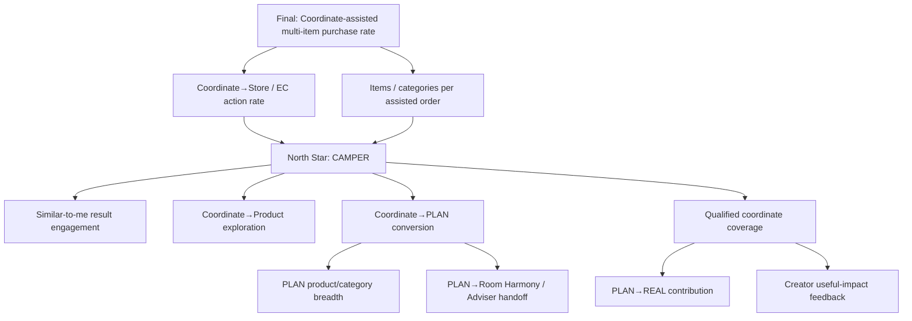

# KPI Tree and North Star Proposal

## Final business goal

同一空間商品の併売率向上。

これはPOSまたは注文DataとExperiment assignmentを接続した後にのみ評価可能なLagging KPIである。

## Proposed North Star

### Coordinate-Assisted Multi-Product Exploration Rate (CAMPER)

> Qualified Coordinateを閲覧したSessionのうち、同一空間の2カテゴリ以上の商品DetailまたはStore / EC actionへ進んだSessionの割合。

```text
CAMPER =
  distinct sessions with >=2 product categories explored after a qualified coordinate
  / distinct sessions viewing a qualified coordinate
```

採用理由:

- Like / post数より最終Business goalに近い。
- POS未接続のMVPでも計測可能。
- 「単品ではなく空間単位の商品認知」という課題に直接対応。
- 単なるclick増ではなくCategory breadthを含む。

Guardrail: 無意味にCategory clickを増やさないよう、dwell / back / repeated error等と併読し、Store / EC actionをIntermediate KPIとして監視する。

## KPI tree



## Metric layers

Goal 4の最終Demoでは、実装済みのmeasurement readinessを次の3層で説明する。

### 1. Product Utility

| Funnel / signal | Current evidence |
|---|---|
| Similar → Coordinate | `discovery_impression`、`coordinate_view`、選択した`comparison_condition` |
| Coordinate → Save | current `CoordinateSave`と`coordinate_saved` |
| Coordinate → PLAN | Private PLAN rowと`plan_started` / `plan_from_coordinate` |
| Product exploration | Coordinate / Product間の遷移、Product ID・role・category |
| Store / EC action | `ec_action`、`room_harmony_handoff_preview`（実接続ではない） |

### 2. Community Reuse

| Funnel / signal | Current evidence |
|---|---|
| Helpful | unique current `HelpfulReaction`とadd / remove event |
| Save | unique current `CoordinateSave` |
| PLAN started | direct Private PLAN row |
| Public adaptation | Parent / Root lineageを持つPublic derivative |
| REAL contribution | USER_DECLARED / UNVERIFIEDなPublic REAL row |

### 3. Seasonal Reuse

| Funnel / signal | Current evidence |
|---|---|
| Challenge Entry | eligibilityを通過したvisible unique Entry |
| Archived Coordinate → PLAN | previous-year viewとdirect Private PLAN |
| Current-year derivative Entry | Archive lineageを持つPublic derivativeのCurrent Challenge Entry |

**Measurement readiness ≠ proven uplift.** Eventとcurrent DB aggregateが取得できることは、併売率、売上、購入Conversion、年間Growthの改善を意味しない。これらは正式なassignment / denominator / attribution / POS・order join / analysis planを承認した後にだけ検証できる。

| Layer | Metric | Definition / note |
|---|---|---|
| Leading | Qualified coordinate view rate | Search / Explore sessionが必要Dataを持つCoordinateを閲覧 |
| Leading | Similar-to-me engagement | Match reason表示後のDetail open / filter completion |
| Leading | Coordinate save rate | Coordinate detail view→save |
| Leading | Product exploration rate | Coordinate→1商品以上 |
| Leading | Multi-category exploration | Coordinate→2カテゴリ以上 |
| Leading | PLAN creation / completion | Start→Room / Need / itemが揃うPlan |
| Intermediate | PLAN product count / category breadth | Quantityよりrole coverageと併読 |
| Intermediate | EC action rate | Official EC click / cart handoff（contract次第） |
| Intermediate | Store action rate | Store view / Room Harmony handoff / adviser booking |
| Intermediate | Saved revisit rate | 7 / 30日等。Identity設計後 |
| Supply | Qualified REAL contribution | Context / product / provenance / moderationを満たす |
| Supply | Adaptation from coordinate | Parent coordinateを持つchild PLAN / REAL |
| Supply | Creator impact | Save / adaptation / product exploration aggregate |
| Supply | Previous-year reuse rate | Archive Coordinate view→Save / PLAN / Adapt |
| Supply | Eligible Challenge participation | eligibilityを満たすunique Coordinate Entry |
| Supply | Seasonal public derivative | Archive / Challenge起点lineageからCurrent Challengeへ戻ったPublic Coordinate |
| Lagging | Assisted multi-item purchase rate | POS / order join必須 |
| Lagging | Items per assisted purchase | A/Bまたはmatched comparison必須 |
| Lagging | Revenue / margin | Price / margin / attribution policy確定後のみ |

## Event model

Current Functional MVPは`comparison_condition = similar | popular | newlife`をUser選択の表示条件として記録する。これはexperiment assignmentではない。正式A/Bにはassignment、exposure semantics、sticky group、baseline、sample size、analysis planが別途必要である。

Minimum events:

| Event | Key properties | PII rule |
|---|---|---|
| `discovery_impression` | coordinate_id, comparison_condition, rank, match_dimension_count | No free text; controlled values only |
| `coordinate_view` | coordinate_id, kind, provenance | No image analysis data |
| `similar_filter_applied` | enum values / bands | No exact address / free text |
| `coordinate_saved` | coordinate_id | Pseudonymous user/session only |
| `product_view_from_coordinate` | coordinate_id, product_id, role, category | Product IDs allowed |
| `plan_started` / `plan_completed` | parent_id, room bands, need enums | No room photo in event |
| `plan_item_changed` | old/new product ID, change_reason enum | No free text by default |
| `ec_action` | coordinate_id, product_ids, destination | No order content unless approved |
| `room_harmony_handoff_preview` | coordinate_id, product_count, PREVIEW destination | Current MVP only; live handoffではない |
| `room_harmony_handoff` | handoff_id, store_id, product_count | Future live contract only; current UI does not fire |
| `real_transition` | plan_id, resulting_coordinate_id, provenance | Future; consent required |
| `seasonal_landing_view` / `archive_view` | season, placement | Controlled values only |
| `challenge_view` | challenge_id, season, challenge_type | No challenge free text |
| `challenge_entry_start` / `complete` / `rejected` | challenge_id, coordinate_id, kind | Rejection detail remains controlled server response |
| `challenge_coordinate_view` / `previous_year_coordinate_view` | challenge_id, coordinate_id, recognition | Recognition is controlled enum |
| `challenge_adapt_start` | challenge_id, coordinate_id, season | No remix note / room photo |
| `recognition_view` | challenge_id, coordinate_id, recognition | Prototype recognition only |

## Experiment framing

MVP experiment candidates:

1. Similar-to-me ranking vs popularity / editorial baseline
2. Coordinate detail with structured roles + total vs current product list presentation
3. Save only vs Save + “My PLANにする”

Do not reuse Existing Room Harmony’s `treatment/control` semantics without a new assignment design. Community experiment ID and exposure event must be explicit.

Current MVPの`similar / popular`切替結果をRandomized A/B resultとして解析・表示してはいけない。

## North-star caveat

**HYPOTHESIS**: CAMPER is a useful leading indicator of assisted co-purchase. It is not proven to correlate with purchase until POS / order data is joined.

## Goal 2 Creator Loop readiness

Goal 2では次を操作・記録可能にするが、効果改善は主張しない。

| Layer | Current DB metric / event |
|---|---|
| Supply | `real_room_publish`、`plan_publish`、current public REAL / PLAN count |
| Utility | current unique `HelpfulReaction`、current `CoordinateSave`、`helpful_add/remove` |
| Reuse | Private PLAN row、`plan_from_coordinate`、Public derivative row、`public_adaptation_publish` |
| Creator value | Creator Profileのhelpful / save / plan started / public adaptation aggregate |
| Commerce bridge | Goal 1の`ec_action`、`room_harmony_handoff_preview` |

`helpful_count`等のProfile表示はcurrent database stateで、Analytics event totalではない。`remix_note`、display name、bio、filename、image path、EXIF、binaryをAnalytics propertyへ送らない。

## Goal 3 Seasonal Loop readiness

Goal 3では次を操作・記録可能にするが、Seasonal Growthや購買効果はまだ主張しない。

| Layer | Current DB metric / event |
|---|---|
| Discovery | Seasonal / Challenge / Archive view events |
| Participation | current visible unique `ChallengeEntry`、REAL / PLAN内訳 |
| Reuse | previous-year coordinate view、Private PLAN、Adapt start、Public derivative lineage |
| Recognition | controlled Prototype Pick viewとCreator recognition count |
| Creator value | seasonal entry count、recognition count、`direct_seasonal_reuse_count` |
| Readiness | `SEASONAL_REUSE` analytics readiness aggregate |

Entry countはcurrent database stateであり、Analytics event totalやPopularityではない。正式評価では`Archive view → PLAN → Public derivative → current Entry`のfunnel、eligible denominator、Season cohort、repeat participationを定義し、POS / orderとは別Consent / attribution設計で接続する。

`direct_seasonal_reuse_count`は、CreatorのChallenge参加Coordinateを直接の親として作られたchild PLAN / Coordinateを数える。公開・非公開、同一・別Sessionを含み、孫以降は含まない。これはCreator画面の説明用aggregateであり、Seasonal upliftやcross-user拡散を証明するKPIではない。
