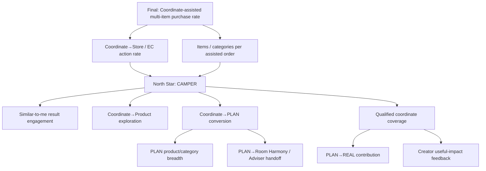

# KPI Tree and North Star Proposal

## Final business goal

同一空間商品の併売率向上。

これはPOSまたは注文DataとExperiment assignmentを接続した後にのみ評価可能なLagging KPIである。

## Proposed North Star

### Coordinate-Assisted Multi-Product Exploration Rate (CAMPER)

> Qualified Coordinateを閲覧したSessionのうち、同一空間の2カテゴリ以上の商品DetailまたはStore / EC actionへ進んだSessionの割合。

```text
CAMPER =
  distinct sessions with >=2 product categories explored after a qualified coordinate
  / distinct sessions viewing a qualified coordinate
```

採用理由:

- Like / post数より最終Business goalに近い。
- POS未接続のMVPでも計測可能。
- 「単品ではなく空間単位の商品認知」という課題に直接対応。
- 単なるclick増ではなくCategory breadthを含む。

Guardrail: 無意味にCategory clickを増やさないよう、dwell / back / repeated error等と併読し、Store / EC actionをIntermediate KPIとして監視する。

## KPI tree



## Metric layers

| Layer | Metric | Definition / note |
|---|---|---|
| Leading | Qualified coordinate view rate | Search / Explore sessionが必要Dataを持つCoordinateを閲覧 |
| Leading | Similar-to-me engagement | Match reason表示後のDetail open / filter completion |
| Leading | Coordinate save rate | Coordinate detail view→save |
| Leading | Product exploration rate | Coordinate→1商品以上 |
| Leading | Multi-category exploration | Coordinate→2カテゴリ以上 |
| Leading | PLAN creation / completion | Start→Room / Need / itemが揃うPlan |
| Intermediate | PLAN product count / category breadth | Quantityよりrole coverageと併読 |
| Intermediate | EC action rate | Official EC click / cart handoff（contract次第） |
| Intermediate | Store action rate | Store view / Room Harmony handoff / adviser booking |
| Intermediate | Saved revisit rate | 7 / 30日等。Identity設計後 |
| Supply | Qualified REAL contribution | Context / product / provenance / moderationを満たす |
| Supply | Adaptation from coordinate | Parent coordinateを持つchild PLAN / REAL |
| Supply | Creator impact | Save / adaptation / product exploration aggregate |
| Lagging | Assisted multi-item purchase rate | POS / order join必須 |
| Lagging | Items per assisted purchase | A/Bまたはmatched comparison必須 |
| Lagging | Revenue / margin | Price / margin / attribution policy確定後のみ |

## Event model

Minimum events:

| Event | Key properties | PII rule |
|---|---|---|
| `coordinate_impression` | coordinate_id, placement, rank, match_dimensions | No free text |
| `coordinate_view` | coordinate_id, kind, provenance | No image analysis data |
| `similar_filter_applied` | enum values / bands | No exact address / free text |
| `coordinate_saved` | coordinate_id | Pseudonymous user/session only |
| `product_view_from_coordinate` | coordinate_id, product_id, role, category | Product IDs allowed |
| `plan_started` / `plan_completed` | parent_id, room bands, need enums | No room photo in event |
| `plan_item_changed` | old/new product ID, change_reason enum | No free text by default |
| `ec_action` | coordinate_id, product_ids, destination | No order content unless approved |
| `room_harmony_handoff` | handoff_id, store_id, product_count | No PII / free text in URL |
| `real_transition` | plan_id, resulting_coordinate_id, provenance | Future; consent required |

## Experiment framing

MVP experiment candidates:

1. Similar-to-me ranking vs popularity / editorial baseline
2. Coordinate detail with structured roles + total vs current product list presentation
3. Save only vs Save + “My PLANにする”

Do not reuse Existing Room Harmony’s `treatment/control` semantics without a new assignment design. Community experiment ID and exposure event must be explicit.

## North-star caveat

**HYPOTHESIS**: CAMPER is a useful leading indicator of assisted co-purchase. It is not proven to correlate with purchase until POS / order data is joined.
