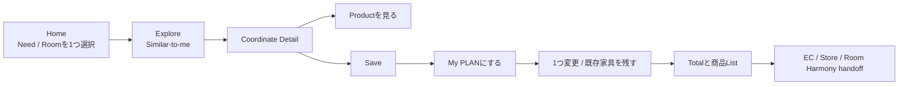

# MVP Definition

## MVP objective

「自分に近いCoordinateを見つけ、商品を空間単位で理解し、Private PLANにしてStore / EC actionへ進む」という最短因果を検証する。

Public communityを完成させることはMVPの目的ではない。

## Hypothesis → required feature

### H1 — Similar-to-me beats popular-only for useful discovery

**HYPOTHESIS**: Room / Need / Budgetが近いCoordinateは、単純なPopular CoordinateよりProduct explorationにつながる。

Required:

- 40〜60件程度の許諾済み / synthetic Seed Coordinate
- Room type / size band / housing / household / budget band / need / style
- 3項目以内のinput、またはFacet filter
- Deterministic similarity scoreとmatch reason
- Popular / editorial baseline
- Impression / view / product-click events

Not required: ML、embedding、full profile、real-time personalization。

### H2 — Structured Coordinate broadens multi-product exploration

**HYPOTHESIS**: Product role、estimated total、Room contextを示すと、画像 + 個別価格だけより複数Category探索が増える。

Required:

- Coordinate detail
- Product role（main / support / lighting / textile等のcontrolled enum）
- Product ID / official URL / price snapshot timestamp
- Estimated totalとavailability caveat
- Product→Coordinate entry
- Category breadth event

Not required: Cart、real inventory、payment、full product catalog replication。

### H3 — Private PLAN creates actionable intent

**HYPOTHESIS**: SaveしたCoordinateを自分向けPLANに変えられると、Store / EC actionが増える。

Required:

- Anonymous / local demo identity
- Save
- `My Coordinate: PLAN`
- Parent Coordinate link
- Room / Need / Budget
- Existing furniture memo / placeholder item
- `keep / replace / add`のlimited item action
- Estimated total and difference
- EC / Store / Room Harmony handoff CTA（stub / contract）
- plan start / completion / action events

Not required: Public publish、multi-user edit、comment、follow、AI image generation。

## MVP user flow

## MVP scope

### In

- Read-only Seed Coordinate browsing
- Similar-to-me deterministic filter / ranking
- Problem-based discovery
- Coordinate detail with provenance and products
- Product→Coordinate lookup
- Save
- Private PLAN with one-generation parent link
- Limited keep / replace / add and existing-furniture representation
- Total estimate
- Official external links
- Room Harmony handoff contract + non-production stub
- Analytics events and user-selected comparison-condition labels（randomized assignmentではない）
- Responsive static / functional prototype sufficient for usability testing

### Explicitly out

- Production React / FastAPI system at full scale
- Production authentication / NITORI account integration
- Public image upload / REAL ROOM publish
- Like / Comment / Follow / notification
- Challenge engine / leaderboard / reward
- Production moderation tooling
- Full 3D editor / room scan
- ML recommendation / AI image recognition / LLM concierge
- Real NITORI internal API / Inventory / POS integration
- Payment / Cart replication
- Production deployment
- Room Harmony code modification or live integration

## MVP data contract

Seed Coordinate is considered `qualified` only when it has:

- id, kind (`PLAN` / `REAL`), provenance
- title, at least one authorized image/reference
- room type and at least one context signal
- at least one need or style
- at least two product references from two roles where appropriate
- price snapshot timestamp or explicit unavailable status
- source attribution / permission note

## Success criteria for proceeding beyond MVP

Quantitative thresholds must be set after baseline measurement; no arbitrary uplift percentage is invented now. Proceed only if:

1. Users understand REAL vs PLAN and official vs user-declared status.
2. Similar-to-me reason is understandable and changes selection behavior relative to baseline.
3. Users can create a PLAN without Staff assistance in a short moderated test.
4. PLAN users explore more than one relevant Product category without obvious click inflation.
5. Store / EC / Room Harmony handoff intent is observed and the context payload is sufficient.
6. Staff confirms the PLAN is useful rather than adding re-entry work.

## Kill / revise criteria

- Users treat PLAN as confirmed stock / price / professional design.
- Similar-to-me input burden outweighs discovery value.
- Save is sufficient and PLAN adds no action intent.
- Staff must manually fix most PLAN data.
- Existing NITORI services already provide the same persistent workflow under an unaudited surface.
