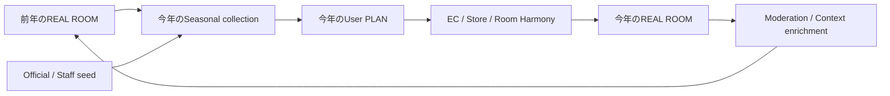

# Seasonal Growth Loop

## Principle

Seasonal Challengeを一回限りの投稿Campaignにしない。前年のREALを今年のPLANへ再利用し、今年のREALを翌年のSeedへ戻す。



## Annual rhythm

| Season | Primary need | Seed content | PLAN prompt | REAL feedback |
|---|---|---|---|---|
| Spring | 新生活、引っ越し、一人暮らし | 6畳 / 1K / low-budget REAL、Official checklist | Room size、Budget、必要家具、既存品 | 実際に困った点・追加購入 |
| Summer | 涼しい部屋、模様替え | Nクール等Seasonal product、風通し / fabric例 | 寝室 / living、暑さNeed、買い足し | 使用感、配置、交換した物 |
| Autumn | 収納、在宅時間、居心地 | Storage / work-from-home REAL | clutter、rental、desk、lighting | Before / After、収納量 |
| Winter | 暖かい部屋、団らん | heating / textile / lighting例 | Room、household、暖かさ、budget | Energy数値は断定せず生活工夫 |
| Always-on | 6畳、賃貸、低予算、pet、child、buy-more | Segment別のquality seed | Similar-to-me条件 | Long-tail coverage |

## New-life detailed loop

```text
前年の「6畳・一人暮らし・5万円以内」REAL
→ 今年の新生活Userが自分に近い事例として発見
→ 商品を残す / 置換する / 既存品を加えてPLAN
→ EC / 店舗で確認
→ 購入・生活開始
→ 何が実際に役立ったかを付けてREALへ更新
→ 翌年の同条件UserのSeed
```

## Challenge placement

初期はTop-level navigationにしない。Homeの補助CTAと`/seasonal` Collectionから入り、Coordinate discoveryを主導線として維持する。

理由:

- **VERIFIED FACT**: NITORIには既にSeasonal featureがある。
- **INFERENCE**: 新規価値はChallenge page自体でなくPLAN / REAL循環。
- **RISK**: Top-level化すると参加者の少ない期間に空の機能が目立つ。
- **DECISION RULE**: 2Season以上でrepeat participationとStore / EC actionへの寄与が確認できた場合に昇格を検討。

## Functional prototype contract

Goal 3では次を実装した。

1. `UPCOMING / ACTIVE / ENDED / ARCHIVED`を明示したChallenge lifecycle。
2. Room size、household、housing、budget、kind、image、minimum Product countのstructured eligibility。
3. Ownerのexisting Public Coordinateを参照するEntry。二重の投稿Modelは作らない。
4. Previous-year Archive → Save / Private PLAN → Adapt → Public derivative → Current Challengeのlineage。
5. official rankingと誤認させないcontrolled `Prototype Pick`。
6. Creator Profileのseasonal participation、recognition、`direct_seasonal_reuse_count`。Challenge参加Coordinateからの直接childだけを数え、公開・非公開、同一・別Sessionを含む。

参加数・REAL / PLAN内訳はcurrent database stateから計算し、Like / view / rankのfake countをSeedしない。Entry作成時はServerがownership、visibility、moderation、duplicate、eligibilityを同じRuleで検証する。詳細は[`challenge-semantics.md`](challenge-semantics.md)。

## Seasonal KPIs

- Similar segment coverage
- Coordinate→PLAN conversion
- PLAN→Store / EC action
- PLAN→REAL transition（将来）
- Prior-year content reuse rate
- New qualified REAL contributions
- Content moderation lead time

投稿数・Like数だけではSeasonal loopの成功としない。
