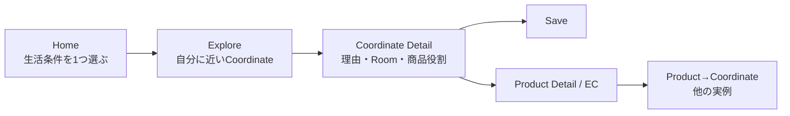
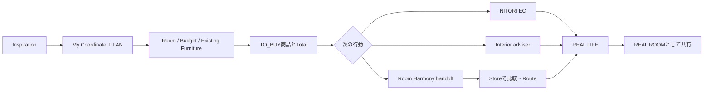
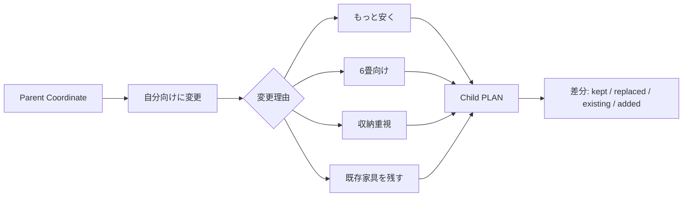
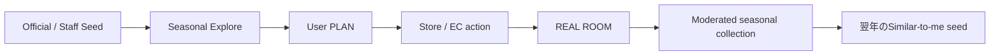

# User Journey

## Journey A — Browse → Save → Product

Target: 希望が曖昧で、まず自分に近い事例を見たいUser。

| Step | User question | Product response | Event | Failure guard |
|---|---|---|---|---|
| Home | 何から考えればよいか | `部屋 / 悩み / 予算`の1問入口 | `discovery_started` | Full profile入力を強制しない |
| Explore | 自分に近いのはどれか | Match reasonを表示 | `coordinate_impression` | Popularityだけで並べない |
| Detail | なぜ自分向けか、何を使うか | Room context、Need、使用Product、Total、provenance | `coordinate_view` | PLANをREALと誤表示しない |
| Save | 後で見たい | Coordinate単位で保存 | `coordinate_saved` | Product favoriteと意味を区別 |
| Product | 商品を確認したい | Official EC / Storeへのlink | `product_click` | price / stockをcopyせずsource表示 |

## Journey B — PLAN → Store → REAL

Target: 引っ越し・模様替えで具体化したいUser。

Key rule: PLANは購入証明ではない。REALへ変える際も、購入商品・写真・利用者申告・検証Levelを別々に保持する。

## Journey C — Coordinate → Adapt / Remix

Target: 好きな事例はあるが、そのままではRoom / Budgetに合わないUser。

Goal 1ではPrivate PLANまで、Goal 2ではそのPLANをstructured reason付きのPublic PLAN / 画像付きREALへ再共有できる。Public derivativeはGeneric galleryやrankingではなく、元CoordinateのDetail / Creator Impactから再利用関係として辿る。

## Journey D — Seasonal Challenge

Target: 新生活等の時期に参加 / 発見するUser。

ChallengeはHomeの補助CTAとSeasonal Collectionから始める。Top-level navigationやCompetition engineは継続参加が確認された後に判断する。

Current functional path:

1. HomeからSeasonal landingへ入る。
2. Active / Constraint / Upcomingとprevious-year Archiveを区別して見る。
3. Challenge Detailでwhy、structured条件、REAL / PLAN内訳、Prototype Pickの非公式境界を確認する。
4. 自分のeligible Public Coordinateで参加、またはChallenge条件をprefillした既存Create flowで作成する。
5. 前年CoordinateはSave / Private PLANへAdaptし、Parent / Root lineageを残す。
6. Public derivativeをCurrent Challengeへ参加させ、Creator Profileからseasonal impactを辿る。

Entryは別Postではない。既存Coordinateへの参加関係で、unpublish / moderation / lineageを共通利用する。

## Cross-journey handoff principles

1. Userは別System名を意識せず、目的Actionで遷移する（例:「店舗で3商品を見る」）。
2. Header / visual identity / back pathを可能な範囲で揃える。
3. Communityは`coordinate_id`、`product_ids`、`store_id`、`return_url`を渡すが、Room Harmony sessionを発行しない。
4. External transition前に何が渡るかを表示し、PIIやfree textをURLに入れない。
5. Official APIがない段階はstub / documented contractに留める。

## Journey-level hypotheses

- **H1**: Similar-to-me理由を示すとPopular-onlyよりCoordinate→Product clickが増える。
- **H2**: Totalと商品役割があると複数Categoryの商品閲覧が増える。
- **H3**: Saved CoordinateからPrivate PLANを作れるとStore / EC actionが増える。
- **H4**: PLAN→REAL transitionがCreatorの「役立った」feedbackにつながると再共有が増える。

すべて **HYPOTHESIS** であり、MVPで段階的に検証する。
