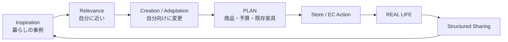

# Product Vision

## One-sentence definition

> 暮らしの事例を「見る」だけで終わらせず、自分の条件に合わせたPLANへ変え、店舗・ECで実現し、REAL ROOMとして次の人へ循環させるNITORI Coordinate Platform。

## Vision

「暮らしの発見から設計、実現、再共有までを循環させるコーディネートプラットフォーム」

## Audit-based correction to the initial hypothesis

- **VERIFIED FACT**: NITORIには既に多数のStaff / User Coordinate、商品接続、Simulation、Adviser、Store / EC assetがある。
- **INFERENCE**: 初期仮説「閲覧中心ContentからPlatformへ」は概ね妥当だが、「Planningが存在しない」は誤りである。Planningは既に部分存在する。
- **REFINED HYPOTHESIS**: 新Productの役割は既存Planningを置換することではなく、Self-serviceで `発見→条件化→軽量PLAN→既存相談 / EC / Storeへ引継ぎ` を成立させることである。

## Target user

最初の対象は「部屋全体の好みが明確でないが、具体的な生活条件・悩みは持っている人」。例:

- 新生活で6畳・1K・5万円以内に収めたい
- 賃貸で収納を増やしたい
- 今ある机を残して在宅勤務の部屋を整えたい
- 気に入ったSofaを起点に、同じ空間の商品を知りたい

明確な指名買いだけのUserや、Professional-grade 3D設計が必要なUserを最初の中心対象にしない。後者は既存インテリア相談への引継ぎ対象である。

## Product principles

1. **Coordinate, not Post**: 中心は投稿ではなく再利用可能な暮らしの設計資産。
2. **Useful for me, not only popular**: 人気よりRoom / Need / Budget適合を優先。
3. **PLAN and REAL are different**: 予定と実在を混同しない。
4. **Add, not replace everything**: Existing furnitureを残す選択肢を第一級にする。
5. **Connect, do not duplicate**: EC / Inventory / Map / Adviser / Room Harmonyを再実装しない。
6. **Explain the causal chain**: 機能は `User value→Behavior→Multi-product exploration→Store / EC action→Co-purchase hypothesis` を説明できるものだけ。
7. **Trust by provenance**: Official / Staff / User declared、REAL / PLAN、AI image等を区別。
8. **Evidence before scale**: Public UGC、Contest、Social graphは需要・運用を検証してから。

## Product promise and non-promise

Promise:

- 「自分の部屋に近い事例」を見つけやすくする。
- 気に入った事例を、自分の予算・条件・既存家具に合わせた検討Listへ変える。
- 商品を空間単位で理解し、既存NITORIのEC / Store / Adviser / Room Harmonyへ進める。

Non-promise:

- Interior designの専門家を置き換えない。
- AIが美的正解や売上を保証しない。
- 未承認の価格・在庫・店舗位置を表示しない。
- Public UGCを集めれば自動的に併売率が上がるとは主張しない。

## Success condition

**HYPOTHESIS**: 同一商品Pageを見たUserのうち、条件の近いCoordinateを経由したUserは、単純な関連商品Listだけを見たUserより、同一空間の複数Categoryを探索し、Store / EC Actionに進みやすい。

この仮説はEvent、Experiment、将来のPOS突合で検証する。現段階のVisionは売上効果を証明していない。
